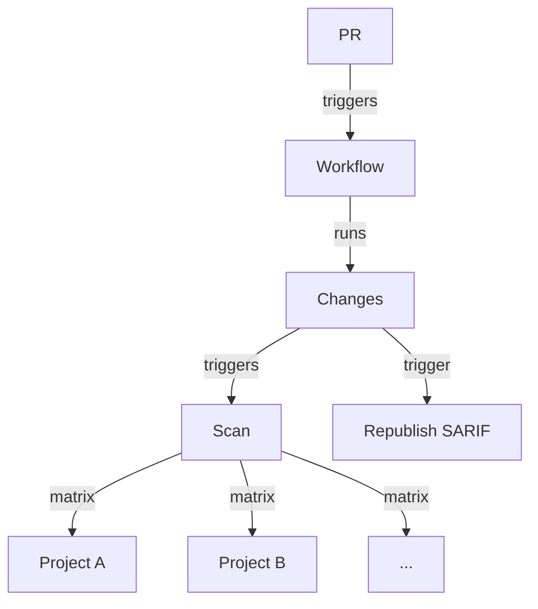

# Monorepo Code Scanning Action

> [!NOTE]
> This is an _unofficial_ tool created by Field Security Specialists, and is not officially supported by GitHub.

Focus Code Scanning with GitHub Advanced Security on parts of your monorepo, split up as you define. This can minimize CI work and time and allow scanning a monorepo in parallel for scheduled scans.

For an example of how to use it for PR scans, see the [`./samples/sample-codeql-monorepo-pr-workflow.yml`](./samples/sample-codeql-monorepo-pr-workflow.yml) in this repository. For a scheduled scan example, see [`./samples/sample-codeql-monorepo-whole-repo-workflow.yml`](./samples/sample-codeql-monorepo-whole-repo-workflow.yml)

The steps pass information along to each other to work properly, so you need to use the format defined in that workflow, altering the inputs as required.

See [Alternatives](#alternatives) for other ways to achieve the same goal.

> [!NOTE]
> This is an _unofficial_ tool created by Field Security Specialists, and is not officially supported by GitHub.

## Overview

You must define a project structure for your repo, with each project being a specific language and subset of paths of directories, to use this tool to split up scans of your monorepo.

If you use C# and an existing [MSBuild project file](https://learn.microsoft.com/en-us/visualstudio/msbuild/walkthrough-creating-an-msbuild-project-file-from-scratch?view=vs-2022), you can directly use that to define the project structure.

For other cases you need to create a JSON file that describes that structure, like so:

```json
{
  "<language>":
    "projects": {
      "<project name>": {
        "paths":
          [
            "<folder path 1>",
            "<folder path 2>",
            ...
          ]
      },
    ...
  },
  ...
}
```

In the description of the `changes` Action you can see more optional keys that can be set at language or project level.

This project definition lets a workflow use the `changes` Action to look for changes in the defined project structure; the `scan` Action then scans any changed projects using CodeQL (or another tool); and lastly `republish-sarif` allows the unscanned parts of the project to pass the required CodeQL checks by republishing the SARIF.



## Using the Action

> [!NOTE]
> This is an _unofficial_ tool created by Field Security Specialists, and is not officially supported by GitHub.

The steps pass information along to each other to work properly, so you need to use the format defined in that sample workflow, altering the inputs as required.

### Branch protection

To make sure you cover all code changes without needing to scan pushes to your default branch, ensure you use a repository ruleset to restrict direct pushes to your default branch.

This will also need a rule to require branches to be up to date before merging.

You may wish to bypass this rule occasionally, so remember to allow for that appropriately, and consider whether you will require a full scan of the repository at that time to ensure changes are scanned. You can use a `workflow_dispatch` trigger on a full scheduled workflow to allow for this.

### Scanning changes in PRs

The `changes` Action looks for changes in your defined project structure.

It also sets the CodeQL configuration to use for the rest of the workflow.

For an example of how to use it for PR scans, see [`./samples/sample-codeql-monorepo-pr-workflow.yml`](./samples/sample-codeql-monorepo-pr-workflow.yml)

#### Setting project structure

The project structure can either be defined in a JSON file and provided by name in the `project-json` input, or can be parsed out of an MSBuild XML file in the `build-xml` input.

It has several purposes - it defines the paths that are watched for changes, and checked out, and also defines CodeQL configuration options.

##### MSBuild file parsing

You can see an example of this XML format in this repository in `./samples/build-projects.xml`.

Currently parsing relies on the projects being defined in exactly the format in the example - with an `ItemGroup` structure.

If you use a `PropertyGroup` or have targets that don't conform to a simple structure that is defined in this way, you may need to write custom parsing of your MSBuild files to properly extract and group the folders and files needed to successfully build the projects.

When using `build-xml` you will need to define any variables used in the input file with concrete values, in a `variables` input, defining them in a YAML format dictionary. A variable looks like `$(FolderADir)`, for example.

##### JSON project structure

> [!NOTE]
> Do not use `./` to lead path or file names

The basic required structure has a top-level key for each language, named as CodeQL does (or with an arbitrary name for non-CodeQL languages). Each language has a `projects` key, and under that each project is a named key that contains `paths`, which is a list of folder names (without a leading `./` - e.g. `src/FolderA`).

In the JSON version, you can optionally specify the build-mode for CodeQL, as `none`, `auto` or `manual` to select that mode, or use `other` to allow scanning with a different code scanning tool than CodeQL. That can be done at language or project level by supplying a `build-mode` key at the appropriate level. A suitable build-mode is defaulted if you do not provide one, and if you use one at the project level it overrides any set at the language level.

You can also include individual files using a `files` key in the project. These files are _not watched_ for changes, but will be included in the sparse checkout along with the folders in the `paths` key. This is to prevent triggering a scan of every project if a top-level build file is changed. If it is necessary, a full-rescan of the repository can be triggered manually at any time using a full-repo workflow. Again, do not use `./` to lead file names.

The `paths` and `files` lists are evaluated by two different engines - one is the `dorny/paths-filter` Action, and the other is the `actions/checkout` Action. The former uses [picomatch](https://github.com/micromatch/picomatch) and the latter uses the [gitignore](https://git-scm.com/docs/gitignore)-style matching and the, so wildcards can be used, but their exact behaviour may differ slightly - it is best to use exact paths where possible.

You can also optionally specify a set of CodeQL queries to use with the `queries` key, again either at language or project level. This is a list of inputs valid for the `queries` input of the `codeql/init` step, as [documented here](https://docs.github.com/en/enterprise-cloud@latest/code-security/code-scanning/creating-an-advanced-setup-for-code-scanning/customizing-your-advanced-setup-for-code-scanning#specifying-additional-queries).

If you do not want to specify `queries` in this way you can also set a global `queries` input to the Action - see below.

An example of a JSON file using a `queries`, `build-mode` and `files` keys is:

```json
{
  "<language>":
    "build-mode": "none",
    "queries": [
      "security-extended",
      "./local/path/to/a/query.qls",
    ]
    "projects": {
      "<project name>": {
        "build-mode": "auto",
        "paths": [
          "<folder path 1>",
          "<folder path 2>",
          ...
        ],
        "files": [
          "<file 1>",
          "<file 2>",
          ...
        ]
      },
    ...
  },
  ...
}
```

If you dynamically generate the project JSON file, then it is best to save it outside of the Actions workspace, such as in `$RUNNER_TEMP`, since a checkout may overwrite it.

###### Setting custom language globs

The files checked for changes in the project `paths` are not all of the files in that path, but a subset, defined per language. There is a bundled set of globs defined for each language, which are searched for in the project paths defined for the project.

You can add to that with `extra-globs` input to the `changes` Action, which takes an inline YAML input, of the form:

```yaml
<language>:
  - <glob1>
  - <glob2>
  ...
```

###### Configuring CodeQL

In addition to settings the `queries` key at the language or project level, you can also set it globally.

If you pass a global `queries` input, as a comma separated list of strings, it allows setting the queries to use for all languages and projects. They use the same format as the `queries` input for the `codeql/init` step, as [documented here](https://docs.github.com/en/enterprise-cloud@latest/code-security/code-scanning/creating-an-advanced-setup-for-code-scanning/customizing-your-advanced-setup-for-code-scanning#specifying-additional-queries), comma separated just as in that case.

Similarly, you can pass in a global `config` or `config-file` input, which use the same format as  [documented here](https://docs.github.com/en/enterprise-cloud@latest/code-security/code-scanning/creating-an-advanced-setup-for-code-scanning/customizing-your-advanced-setup-for-code-scanning#using-a-custom-configuration-file) and [here](https://docs.github.com/en/enterprise-cloud@latest/code-security/code-scanning/creating-an-advanced-setup-for-code-scanning/customizing-your-advanced-setup-for-code-scanning#specifying-configuration-details-using-the-config-input). This _cannot_ currently be set at the language or project level, only globally.

The effective config used is a combination of the inputs created from the paths of the project, and any queries set in the separate `queries` input to this Action, overlaid with the content of the `config` or `config-file` inputs.

### Whole repo scanning

In contrast to the `changes` Action, the `whole-repo` Action allows scanning the entire monorepo in a scheduled scan.

This is useful for taking advantage of new CodeQL queries or 3rd party SAST improvements, on existing code.

Doing this parallel scan can make scanning the whole monorepo feasible on much smaller runners, and cut the wall-clock time for a scan to acceptable levels.

It is also a way to ensure all code has been scanned recently, which may be required for compliance purposes.

The Action takes much the same inputs as the `changes` Action, but does not accept an `extra-globs` input, as it is not looking for changes in the repository. There is also no need to use the `republish-sarif` Action with it.

Each project, as defined in the projects input, is scanned in parallel, and the results are uploaded independently.

For a scheduled scan example, see [`./samples/sample-codeql-monorepo-whole-repo-workflow.yml`](./samples/sample-codeql-monorepo-whole-repo-workflow.yml)

### Scan

The `scan` Action scans any changed projects using CodeQL (or optionally another tool), using just the changes to the defined projects.

A sparse checkout of the project in which changes happened is used to speed up the checkout, and target scans at just that project.

The scan can use a custom code scanning workflow to do manual build steps and any required preparation steps before the scanning, which must be located at `.github/workflows/code-scanning-custom-analysis.yml` in your repository. This is used for the `build-mode` of `manual` or `other`.

You can see an example of this custom workflow in this repository in [`./samples/code-scanning-custom-analysis.yml`](./samples/code-scanning-custom-analysis.yml).

This must have conditional checks to apply the correct build steps for the language and project.

### Republish

The  `republish-sarif` Action allows the unscanned parts of the project to pass the required CodeQL checks.

The SARIF is republished, meaning a complete set of Code Scanning results is attached to the PR, copied from the target branch, whether or not the project was changed during the PR.

It will also republish the scanning results onto the target branch, on merge. This saves running a full repo scan on the target branch.

To allow this, you need to give the workflow the `closed` type on the `pull_request` trigger to be able run on PR merge, as shown in the sample workflow, and here:

```yaml
  pull_request:
    branches: ["main"]
    types:
      - opened
      - reopened
      - synchronize
      - closed
```

## Limitations

Actions can create matrix jobs with a maximum of 256 targets. This means that monorepos with more than 256 projects must be divided up into more than one workflow, until something is done to deal with this in this Action (if that is possible).

The checks feature of GitHub can take a maximum of 1000 checks with the same name. That means that monorepos with more than 1000 projects cannot be scanned with them all scanned individually; so several must be grouped together to get under this 1000 threshold.

The custom CodeQL/other tool analysis requires manual control over which build steps are applied to which project, in a single workflow, in contrast to the declarative design of the rest of the workflow.

This tool cannot help with a monolith that cannot be split up into smaller projects.

If you have a monorepo with lots of languages that exist in the same projects you will need to duplicate that project structure multiple times for each affected language. A future option could take a single named project with several paths and languages - raise an issue if that would be helpful, please.

## Tests

Local tests for the scripts this relies on are located in the `tests` folder. They are run with `./run.sh`, vs using a testing framework.

Testing is also done end-to-end using the private [`advanced-security/sample-csharp-monorepo`](https://github.com/advanced-security/sample-csharp-monorepo/) repository.

## License

This project is licensed under the terms of the MIT open source license. Please refer to the [LICENSE](LICENSE) for the full terms.

## Maintainers

See [CODEOWNERS](CODEOWNERS) for the list of maintainers.

## Support

> [!NOTE]
> This is an _unofficial_ tool created by Field Security Specialists, and is not officially supported by GitHub.

See the [SUPPORT](SUPPORT.md) file.

## Background and acknowledgements

The `changes` Action relies on the [`dorny/paths-filter`](https://github.com/dorny/paths-filter/) Action.

See the [CHANGELOG](CHANGELOG.md), [CONTRIBUTING](CONTRIBUTING.md), [SECURITY](SECURITY.md), [SUPPORT](SUPPORT.md), [CODE OF CONDUCT](CODE_OF_CONDUCT.md) and [PRIVACY](PRIVACY.md) files for more information.

### Alternatives

This tool is designed to provide a build-system-agnostic way to split up a monorepo for scanning, but it is far from the only way to efficiently scan a monorepo.

A monorepo-friendly build tool can be used to define build targets and dependencies, check out only the required code to build the target, and run custom commands on that target.

You can inject CodeQL into the build tool as such as custom command; for compiled languages you can instrument the build process to watch for the build commands and run CodeQL on the output; or you can run CodeQL on the subset of the checked out code that is required to build the target.

It will be necessary to keep track of the CodeQL category assigned to each build target, to avoid clashes.

See the GitHub documentation on [Using code scanning with your existing CI system](https://docs.github.com/en/enterprise-cloud@latest/code-security/code-scanning/integrating-with-code-scanning/using-code-scanning-with-your-existing-ci-system)
