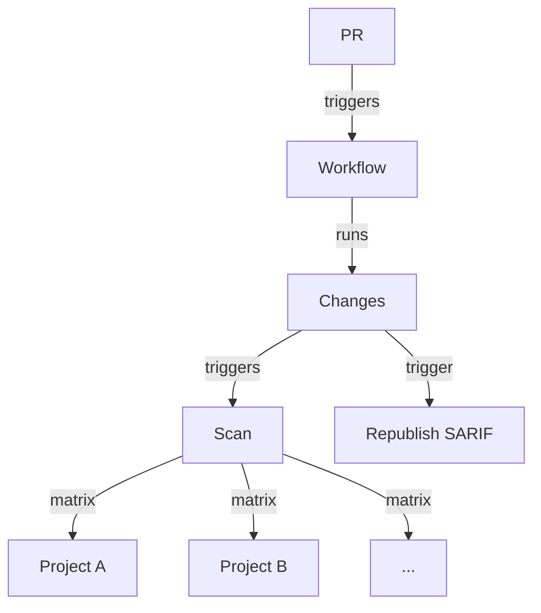

# Monorepo Code Scanning Action

> [!WARNING]
> This is an _unofficial_ tool created by Field Security Specialists, and is not officially supported by GitHub.

Focus CodeQL scans on just the changed parts of your monorepo, split up as you define.

For an example of how to use it, see the `./samples/sample-codeql-monorepo-workflow.yml` in this repository.

The steps pass information along to each other to work properly, so you need to use the format defined in that workflow, altering the inputs as required.

> [!WARNING]
> This is an _unofficial_ tool created by Field Security Specialists, and is not officially supported by GitHub.

## Overview

If you can define a project structure for your repo, with each project being a specific language and subset of folders, then you can use this tool to split up scans of your monorepo.

If you use C# and an existing [MSBuild project file](https://learn.microsoft.com/en-us/visualstudio/msbuild/walkthrough-creating-an-msbuild-project-file-from-scratch?view=vs-2022), you can directly use that to define the project structure.

For other cases you need to create a JSON file that describes that structure, like so:

```json
{
  "<language>": {
    "<project name>" : ["<folder path 1>", "<folder path 2>", ...],
    ...
  },
  ...
}
```

This then lets a workflow use the `changes` Action to look for changes in the defined project structure; the `scan` Action then scans any changed projects using CodeQL; and lastly `republish-sarif` to allow the unscanned parts of the project to pass the required CodeQL checks by republishing the SARIF.



## Using the Action

> [!WARNING]
> This is an _unofficial_ tool created by Field Security Specialists, and is not officially supported by GitHub.

The steps pass information along to each other to work properly, so you need to use the format defined in that sample workflow, altering the inputs as required.

> [!NOTE]
> These Actions are composite Actions, and rely on steps using `bash`, so are not currently compatible with Windows runners.

### Branch protection

To make sure you cover all code changes without needing to scan pushes to your default branch, ensure you use a repository ruleset to restrict direct pushes to your default branch.

This will also need a rule to require branches to be up to date before merging.

You may wish to bypass this rule occasionally, so remember to allow for that appropriately, and consider whether you will require a full scan of the repository at that time to ensure changes are scanned. You can use a `workflow_dispatch` trigger on a full scheduled workflow to allow for this.

### Changes

The `changes` Action looks for changes in your defined project structure.

That structure can either be defined in a JSON file and provided by name in the `project-json` input, or can be parsed out of a C# build XML file in the `build-xml` input.

When using `build-xml` you will need to define any variables used in the input file with concrete values, in a `variables` input, defining them in a YAML format dictionary.

You can see an example of this XML format in this repository in `./samples/build-projects.xml`.

### Scan

The `scan` Action scans any changed projects using CodeQL, using just the changes to the defined projects.

A sparse checkout of the project in which changes happened is used to speed up the checkout and target scans at just that project.

The scan can use a custom CodeQL scanning workflow to do manual build steps and any required preparation steps before the scanning, which must be located at `.github/workflows/codeql-custom-analysis.yml` in your repository, and activated using the input `custom-analysis: true`.

You can see an example of this custom workflow in this repository in `./samples/codeql-custom-analysis.yml`.

This must have conditional checks to apply the correct build steps for the language and project.

### Republish

The  `republish-sarif` Action allows the unscanned parts of the project to pass the required CodeQL checks.

The SARIF is reublished, meaning a complete set of Code Scanning results is attached to the PR, copied from the target branch, whether or not the project was changed during the PR.

## Limitations

This tool is currently designed to split up scanning of a monrepo with CodeQL only. It is not designed to work with other scanning tools, but could be adapted to do so.

The custom CodeQL analysis requires manual control over which build steps are applied to which project, in a single workflow, in contrast to the declarative design of the rest of the workflow.

It is necessary to do a shallow checkout of the repository in the `changes` step, followed by further git operations done by the `dorny/paths-filter` Action, to get the correct diff for the `scan` step. For large monorepos this can be slow.

This tool cannot help with a monolith that cannot be split up into smaller projects.

The files checked for changes in the project paths are not all of the files in that path, but a subset, defined per language. They are a fixed set of globs defined in `changes/build-filters.js`. If you need to change these to correctly spot changes, you will need to raise a PR to this repository. This is not currently extensible.

If you have a monorepo with lots of languages that exist in the same projects you will need to duplicate that project structure multiple times for each affected language. A future option could take a single named project with several paths and languages - raise an issue if that would be helpful, please.

## Tests

Local tests for the scripts this relies on are located in the `tests` folder. They are run with `./run.sh`, vs using a testing framework.

Testing is also done end-to-end using the [`advanced-security/sample-csharp-monorepo`](https://github.com/advanced-security/sample-csharp-monorepo/) repository.

## License

This project is licensed under the terms of the MIT open source license. Please refer to the [LICENSE](LICENSE) for the full terms.

## Maintainers

See [CODEOWNERS](CODEOWNERS) for the list of maintainers.

## Support

> [!WARNING]
> This is an _unofficial_ tool created by Field Security Specialists, and is not officially supported by GitHub.

See the [SUPPORT](SUPPORT.md) file.

## Background and acknowledgements

The `changes` Action relies on the [`dorny/paths-filter`](https://github.com/dorny/paths-filter/) Action.

See the [CHANGELOG](CHANGELOG.md), [CONTRIBUTING](CONTRIBUTING.md), [SECURITY](SECURITY.md), [SUPPORT](SUPPORT.md), [CODE OF CONDUCT](CODE_OF_CONDUCT.md) and [PRIVACY](PRIVACY.md) files for more information.
